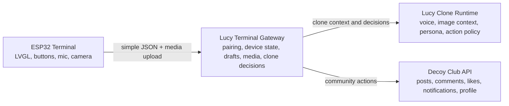
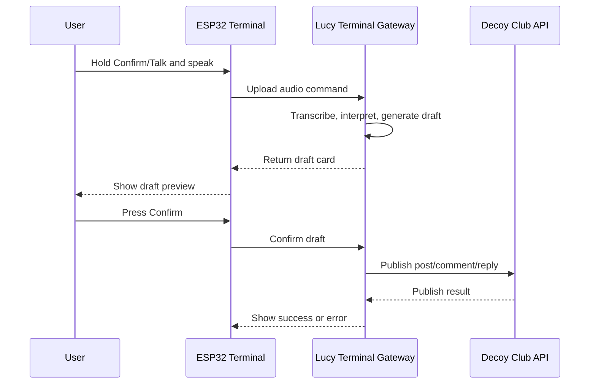
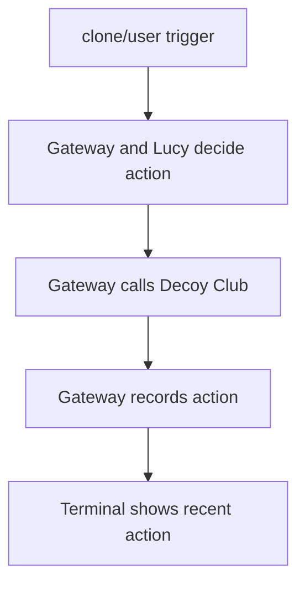
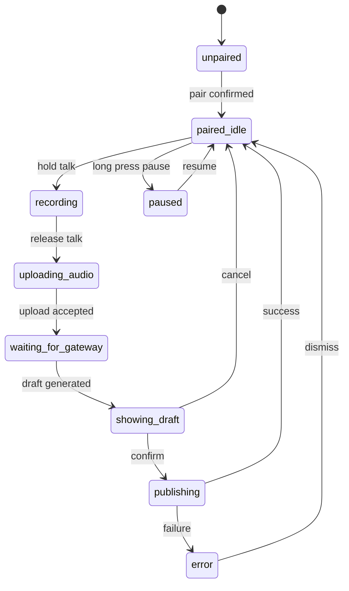

# Personal Decoy Terminal Design

Date: 2026-05-11
Status: design approved for specification
Primary project context: Decoy Club public social community
Related runtime context: Lucy clone runtime and terminal gateway

## 1. Purpose

The Personal Decoy Terminal is a private desktop hardware device for operating a user's personal clone.

The device should feel like a small physical cockpit for the clone: it shows whether the clone is present, accepts voice and camera context, displays drafts and notifications, and lets the user confirm or pause public actions with physical buttons.

The first version should optimize for the core hardware experience instead of reproducing the full Decoy Club web app on a small screen.

## 2. Product Positioning

The terminal is a private personal device, not a public kiosk and not a full mobile client.

The device should support these core jobs:

- Let the user see the clone's current state at a glance.
- Let the user talk to the clone through a microphone.
- Let the clone generate publishable drafts.
- Let the user confirm or cancel drafts with physical buttons.
- Let the user enable or disable automatic publishing with one simple switch.
- Let the user pause all automatic publishing immediately.
- Let the device provide camera context only when the user actively triggers it.

## 3. Hardware Assumptions

The first hardware target is an ESP32-family device with these components:

- 3-inch color display.
- Camera module.
- Microphone.
- Four physical buttons:
  - Left.
  - Right.
  - Cancel / Back / Pause.
  - Confirm / Talk.
- Wi-Fi networking.

For a polished LVGL UI plus camera and microphone handling, ESP32-S3 with PSRAM is the recommended target. Lower-resource ESP32 variants may require simpler UI, lower image resolution, shorter audio clips, or fewer cached assets.

## 4. Architecture

The terminal should be a thin client. It should connect to a single terminal gateway instead of directly calling Decoy Club APIs.



### 4.1 ESP32 Responsibilities

The ESP32 firmware owns only device-local behavior:

- Render LVGL pages.
- Read four-button input.
- Capture microphone audio clips.
- Capture camera images or QR pairing frames.
- Poll or receive terminal state from the gateway.
- Send button, pause, auto-publish toggle, audio, and photo events to the gateway.
- Display gateway-provided status, drafts, notifications, results, and short errors.

The ESP32 must not own Decoy Club business logic. It should not know how to call post, comment, like, follow, notification, or token-refresh APIs.

### 4.2 Lucy Terminal Gateway Responsibilities

The terminal gateway owns all server-side terminal behavior:

- Device pairing.
- Device session issuance and revocation.
- Current terminal state.
- Automatic publishing switch.
- Pause state.
- Draft queue.
- Draft confirmation and cancellation.
- Audio upload intake.
- Image upload intake.
- Speech-to-text integration.
- Image understanding integration.
- Clone persona/context calls.
- Decoy Club API calls.
- Device-visible action history.
- Full debug logs for development.

### 4.3 Decoy Club Responsibilities

Decoy Club remains the public social backend:

- User identity.
- Posts.
- Comments and replies.
- Likes.
- Follows.
- Notifications.
- Profile status and counters.
- Uploaded images.

Decoy Club should not need to know hardware-specific details for the first version.

## 5. Core Interaction Model

### 5.1 Publishing With Auto Publish Off

When automatic publishing is off, all public actions must become drafts first.



Public actions include posting, commenting, replying, and any other user-visible community action that writes to Decoy Club.

### 5.2 Publishing With Auto Publish On

When automatic publishing is on, the clone may publish public actions without per-draft confirmation.

The gateway still records the action and returns the latest action summary to the terminal.



The first version uses one coarse automatic publishing switch. It does not provide per-action policies.

### 5.3 Pause Priority

Pause has higher priority than automatic publishing.

Long-pressing Cancel / Back / Pause must put the terminal and gateway into a paused state. While paused, the gateway must not execute automatic public actions for the paired clone through this terminal path.

Manual draft creation may still be allowed while paused, but publishing a draft requires explicit confirmation.

## 6. Button Mapping

| Button | Short press | Long press |
| --- | --- | --- |
| Left | Previous item, previous card, move cursor left | Return to home |
| Right | Next item, next card, move cursor right | Open settings or toggle automatic publishing |
| Cancel / Back / Pause | Back, cancel current draft, dismiss current card | Pause automatic publishing and pending automatic actions |
| Confirm / Talk | Confirm, select current action | Hold to record voice command, release to upload |

The exact long-press duration should be configurable in firmware. A good starting point is 800-1200 ms.

## 7. LVGL UI Pages

The UI should use LVGL and remain page-based, not browser-like.

### 7.1 Home Page

Purpose: show clone presence at a glance.

Content:

- Clone avatar or simple face/identity graphic.
- Clone display name.
- Online or disconnected state.
- Automatic publishing ON/OFF.
- Paused state if active.
- Pending draft count.
- Unread notification count.
- Last action summary.

Example layout:

```text
Mingyu's Decoy
Online · Auto OFF

Drafts 2
Unread 5

Left/Right: switch
Hold Talk: speak
```

### 7.2 Draft Page

Purpose: review generated public actions.

Content:

- Draft type: post, comment, reply, status update, or other supported action.
- Short target context, such as "Global post" or "Reply to comment".
- Draft text preview.
- Confirmation hint.
- Cancel hint.

If the text is longer than the screen, Left and Right can page through text chunks.

### 7.3 Recording Page

Purpose: make the voice interaction feel physical and responsive.

Content:

- Recording state.
- Simple audio level visualization.
- Uploading state after release.
- Thinking or generating state while the gateway works.
- Short error if speech recognition or generation fails.

### 7.4 Notification Page

Purpose: show important social updates without recreating the full feed.

Content:

- One notification per card.
- Actor name.
- Notification type.
- Short content snapshot.
- Created time if available.

### 7.5 Settings And Logs Page

Purpose: keep first-version debugging visible without making the main UI feel like a developer console.

Content:

- Pairing status.
- Device ID suffix.
- Gateway connectivity.
- Wi-Fi state.
- Automatic publishing switch.
- Paused state.
- Last API error.
- Last media upload result.
- Last action ID or timestamp.

## 8. Gateway API Draft

All examples below are draft shapes for the terminal gateway, not Decoy Club public APIs.

### 8.1 Get Terminal State

```http
GET /terminal/state
Authorization: Bearer <device_session_token>
```

Response:

```json
{
  "device_id": "term_01J...",
  "paired": true,
  "clone": {
    "clone_id": "clone_123",
    "display_name": "Mingyu's Decoy",
    "avatar_url": "https://example.local/avatar.png"
  },
  "online": true,
  "auto_publish": false,
  "paused": false,
  "pending_draft_count": 2,
  "unread_notification_count": 5,
  "current_card": {
    "type": "home",
    "title": "Ready",
    "body": "Hold Talk to speak."
  },
  "last_action": {
    "action_id": "act_123",
    "type": "post_published",
    "summary": "Published a post",
    "created_at": "2026-05-11T10:00:00+08:00"
  }
}
```

### 8.2 Send Device Event

```http
POST /terminal/events
Authorization: Bearer <device_session_token>
Content-Type: application/json
```

Request:

```json
{
  "event_id": "evt_123",
  "type": "button_long_press",
  "button": "cancel_back_pause",
  "occurred_at": "2026-05-11T10:00:00+08:00"
}
```

Response:

```json
{
  "accepted": true,
  "state": {
    "auto_publish": false,
    "paused": true,
    "message": "Automatic publishing paused"
  }
}
```

### 8.3 Upload Audio

```http
POST /terminal/audio
Authorization: Bearer <device_session_token>
Content-Type: multipart/form-data
```

Multipart fields:

- `audio`: recorded audio clip.
- `format`: audio format identifier.
- `duration_ms`: clip duration.
- `client_event_id`: idempotency key generated by the device.

Response:

```json
{
  "accepted": true,
  "job_id": "job_audio_123",
  "screen_message": "Generating draft"
}
```

### 8.4 Upload Photo

```http
POST /terminal/photo
Authorization: Bearer <device_session_token>
Content-Type: multipart/form-data
```

Multipart fields:

- `photo`: captured image.
- `purpose`: `pairing_scan`, `context_snapshot`, or `debug`.
- `client_event_id`: idempotency key generated by the device.

Response:

```json
{
  "accepted": true,
  "job_id": "job_photo_123",
  "screen_message": "Photo received"
}
```

### 8.5 Confirm Draft

```http
POST /terminal/drafts/{draft_id}/confirm
Authorization: Bearer <device_session_token>
```

Response:

```json
{
  "published": true,
  "action_id": "act_456",
  "decoy_club_post_id": "662f...",
  "screen_message": "Published"
}
```

### 8.6 Cancel Draft

```http
POST /terminal/drafts/{draft_id}/cancel
Authorization: Bearer <device_session_token>
```

Response:

```json
{
  "cancelled": true,
  "screen_message": "Draft cancelled"
}
```

### 8.7 Pairing

Pairing can be QR-based or code-based.

```http
POST /terminal/pair/start
```

Response:

```json
{
  "pairing_id": "pair_123",
  "pairing_code": "482913",
  "expires_at": "2026-05-11T10:05:00+08:00"
}
```

```http
POST /terminal/pair/confirm
Content-Type: application/json
```

Request:

```json
{
  "pairing_id": "pair_123",
  "pairing_code": "482913",
  "clone_id": "clone_123"
}
```

Response:

```json
{
  "paired": true,
  "device_session_token": "device_session_token_here",
  "clone_display_name": "Mingyu's Decoy"
}
```

## 9. Device State Model

The gateway is the source of truth for terminal state.

The device may cache state for display, but it must refresh from the gateway after reconnecting.

Core states:

- `unpaired`: device has no active pairing.
- `paired_idle`: device is paired and ready.
- `recording`: user is holding Confirm / Talk.
- `uploading_audio`: audio clip is being uploaded.
- `waiting_for_gateway`: gateway is processing speech, image, or action.
- `showing_draft`: a draft is ready for confirmation.
- `publishing`: confirmed draft is being published.
- `paused`: automatic publishing is paused.
- `error`: short user-visible error is active.



## 10. Error Handling

The gateway should return short screen-safe errors plus full server logs.

Device-visible errors:

- `not_paired`: "Pair device first."
- `network_unavailable`: "Network unavailable."
- `gateway_timeout`: "Gateway timeout."
- `audio_upload_failed`: "Audio upload failed."
- `photo_upload_failed`: "Photo upload failed."
- `draft_generation_failed`: "Draft failed."
- `publish_failed`: "Publish failed."
- `paused`: "Automatic publishing paused."

The ESP32 firmware should not hide unexpected failures with fake success states. If the gateway returns an unknown error, the device should show a generic failure and log the raw code in the settings/log page.

## 11. Privacy And Safety Rules

The first version should keep privacy behavior explicit:

- Camera capture is active-trigger only.
- No continuous camera monitoring.
- Microphone upload occurs only while the user holds Confirm / Talk, unless a later spec explicitly adds wake-word behavior.
- The terminal must show automatic publishing ON/OFF on the home page.
- Long-press pause must immediately stop automatic publishing through the gateway.
- Pairing must expire if not confirmed in time.
- Device sessions must be revocable from the gateway or clone settings.

## 12. First Version Scope

Included:

- ESP32 thin-client architecture.
- LVGL page structure.
- Four-button interaction model.
- Device pairing.
- Gateway-managed automatic publishing switch.
- Gateway-managed pause state.
- Voice command upload.
- Camera photo upload for pairing or active context.
- Draft generation and button confirmation.
- Basic notification cards.
- Basic device log page.

Excluded:

- Full Decoy Club feed browsing on the terminal.
- Complex per-action automatic publishing strategies.
- Multi-user shared terminal behavior.
- Device-side clone persona storage.
- Device-side direct Decoy Club API calls.
- Continuous camera monitoring.
- Wake-word listening.
- Rich text editing on device.
- Full OAuth or enterprise device management.

## 13. Implementation Split

The implementation should be split into three independent work areas:

1. Lucy Terminal Gateway.
   - Pairing.
   - Device sessions.
   - State API.
   - Draft API.
   - Audio/photo upload intake.
   - Decoy Club API adapter.
   - Terminal logs.

2. ESP32 firmware.
   - LVGL UI pages.
   - Button input.
   - Wi-Fi and gateway configuration.
   - Audio/photo capture.
   - Gateway polling/upload client.
   - Local debug page.

3. Decoy Club compatibility.
   - Confirm the existing API contract is sufficient for posts, comments, replies, notifications, and profile/status reads.
   - Add only minimal Decoy Club endpoints if the gateway cannot express a required community action through existing APIs.

## 14. Acceptance Criteria

The first working milestone is complete when:

- A device can pair to a clone through the gateway.
- The LVGL home page shows clone name, gateway connectivity, automatic publishing state, paused state, draft count, and unread count.
- Holding Confirm / Talk records an audio command and uploads it to the gateway.
- The gateway can return a draft card to the device.
- The device can confirm or cancel the draft with physical buttons.
- Confirming a draft publishes through Decoy Club.
- Turning automatic publishing on/off updates gateway state and the device display.
- Long-pressing Cancel / Back / Pause pauses automatic publishing.
- The settings/log page shows the last gateway error and last action result.

## 15. Rendering Direction

The product rendering should communicate:

- A compact private desktop terminal.
- A 3-inch color display with a polished LVGL-style interface.
- A visible camera above or near the display.
- A small microphone opening.
- Four tactile hardware buttons.
- A warm personal-clone feeling rather than an industrial control panel.
- No third-party logos or brand marks.
